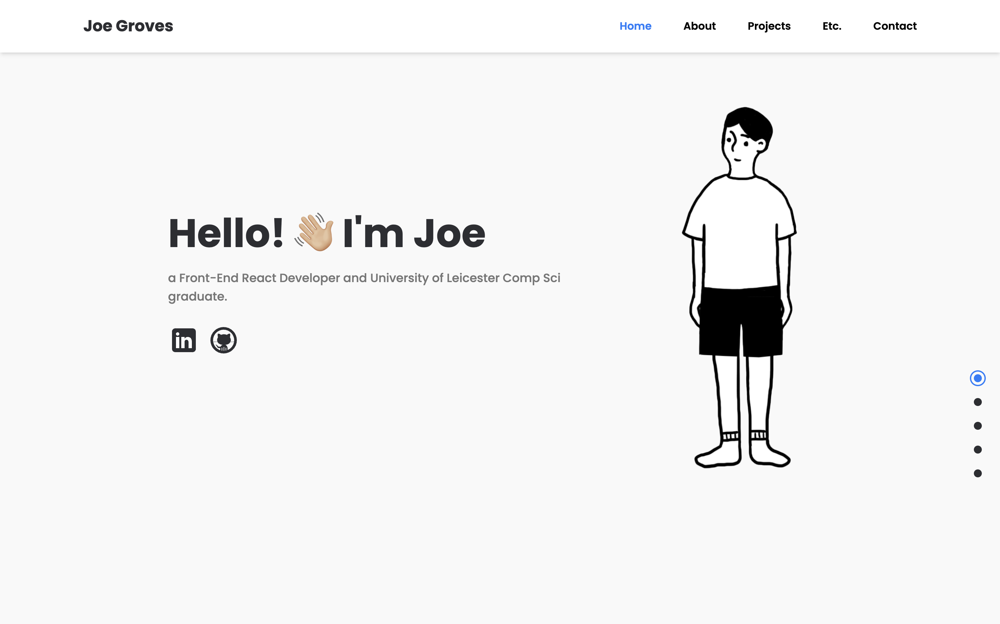

# Joe Groves Portfolio

<h2 align="center">
  Joe Groves Personal Portfolio Site 
  <a href="https://www.joewesleygroves.com/" target="_blank">joewesleygroves.com</a>
</h2>

  

 

## About The Project

#### Duration
- July 2024

 

A responsive portfolio site for my own personal use. It showcases my past coding and creative projects, a little biography section, the tech stacks I am proficient in, and a contact section to reach me.

## Built With

This front-end project was built using these technologies:
- React.js 
- Tailwind CSS 
- Framer-Motion

## Features

**📱 Fully Responsive**

**📜 Smooth Scrolling with Framer Motion**

**🎨 Styled with Tailwind CSS**

## Prerequisites

To clone this repository, you will need `Node.js` and `git` installed globally on your computer.

## Installation and Setup

1. Installation: `npm install`

2. Move into the project directory: `cd joeygroves.github.io`

3. In the project directory, run: `npm run dev`

This will run the app in the development mode.\
Open [http://localhost:5173](http://localhost:5173) to view the web page in the browser.

## Reflection

### What I’ve Learned

In this particular project, I've learned how to set up Tailwind CSS in Vite, apply my CSS Flexbox fundamentals to style a responsive website, deploy a website through GitHub pages and link DNS records to a custom domain name. This was the project where I had felt that I understood my CSS Flexbox fundamentals, and became quite confident in styling certain sections of the website in accordance to my imagination. I no longer felt like I was limited by what I could do, and instead I just styled the website to my own design specifications.

### Problems Encountered

Many of the problems I encountered was during the development process, in particular visual bugs. Due to the nature of building a responsive portfolio site that is suitable for desktop, tablet and mobile screens, many of the problems involved styling and aligning content so that it fits within a certain width size. Hence, I had to implement a custom hood called 'useMediaQuery' so that I can manipulate the DOM and show/hide certain content and containers, depending on the screen size.

Another problem I had encoutered was during the deployment of the site itself to GitHub pages. I was confused as none of my images and favicon icon were appearing in production, when it was working fine during development. The problem, it turns out, was that I had been referencing the wrong file path to the images in all of my files. So I had to painstakingly change the file paths of every image tag in my project, which took a lot of time.

In addition, I found it challenging to connect my custom domain name into GitHub pages. I had to read through the documentation which was seldom in-order or made sense. I wish that the documentation was organised, for one, and simplified. As some of the concepts were repeated more than twice in the same section. Which confused a lot.

### Future Directions

In the future, if I were to build this type of project again. I would definitely design everything on Figma beforehand, so I didn't have to go back and forth with my design choices.

Also, if I were to work on this project again in the future, I would maybe try and optimise the website to be suitable for 4K screens. 

Overall, I'm very happy with how my website turned out and I've learned a lot in the process. Which I am able to take with me in my subsequent and future project.

## Credits

Joe Groves

